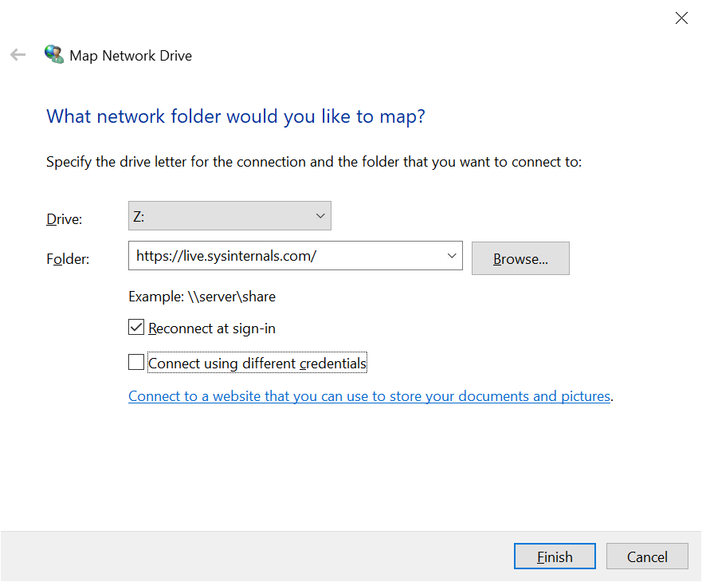
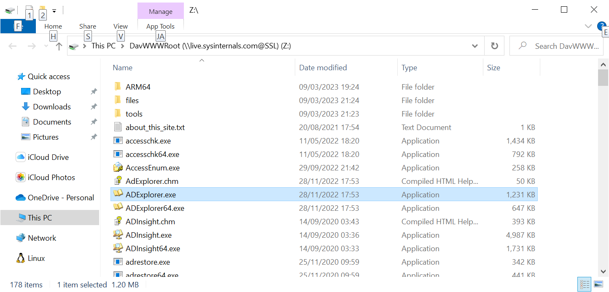

# WebDAV

## Web Distributed Authoring and Versioning
WebDAV is a protocol for reading and writing content over HTTP
* Created in 1999
* Extension of HTTP
* Defines more verbs, and XML payloads

## HTTP Verbs - Read

* **GET**: Read a file or directory, could be binary content
* **PROPFIND**: Retrieve properties - e.g. size, type

## HTTP Verbs - Edit

* **PUT**: Create a file
* **DELETE**: Remove a file or directory
* **COPY**: Copy file or directory
* **MKCOL**: Create a directory
* **MOVE**: Move or rename a file or directory
* **PROPPATCH**: Change and delete multiple properties

## HTTP Verbs - Locking

* **LOCK**: Put a lock on a resource. Supports both shared and exclusive locks
* **UNLOCK**: Remove a lock from a resource

## What Does it Mean?
Right Click > Map Network Drive

## Mount an HTTP API as a Network Drive

## Mounting Works on MacOS and Linux/Unix Too

* _Screenshots goes here_

## Web Distributed Authoring and Versioning

But where is the **versioning**?

## Web Distributed Authoring (and Versioning)

* Versioning comes later
* Because versionign is difficult

## Q & A

1. We can mount an API as a drive
2. Versioning is difficult
